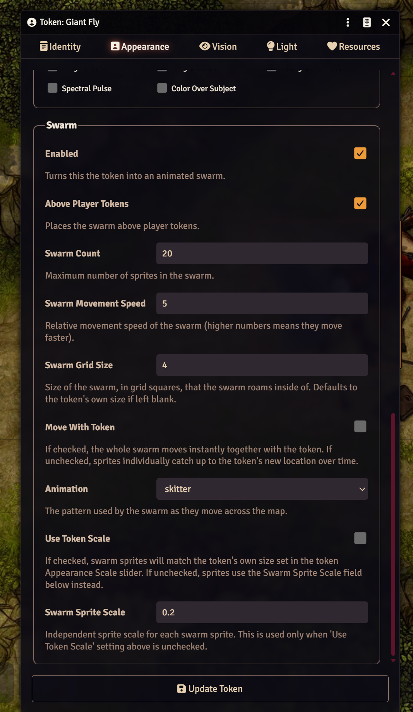
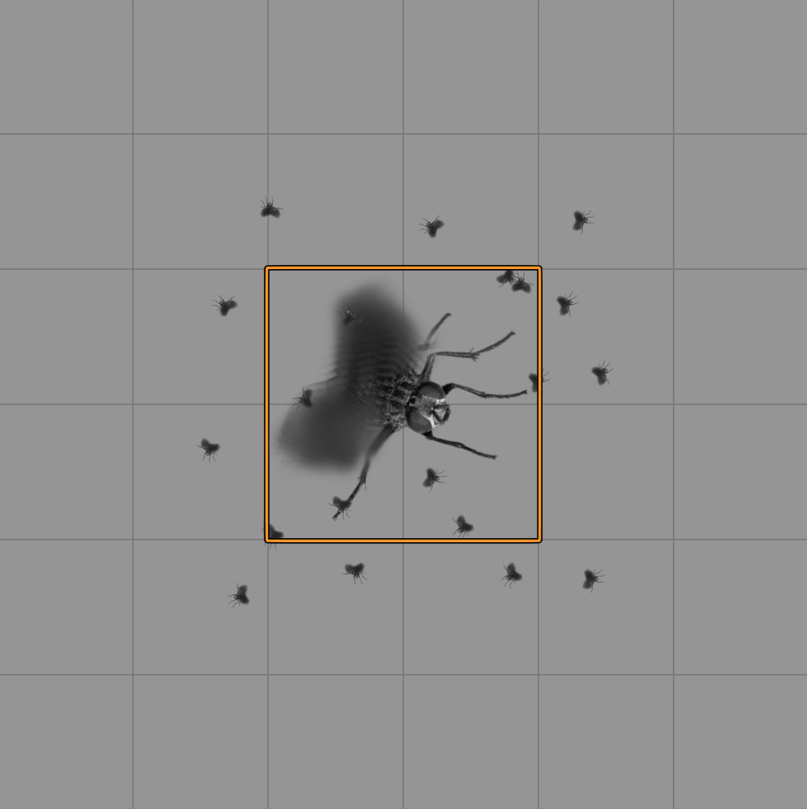
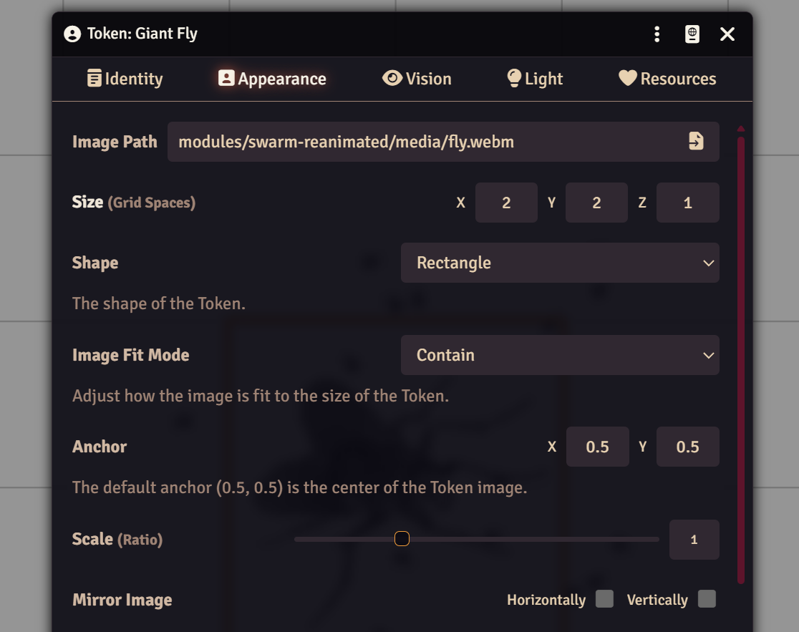
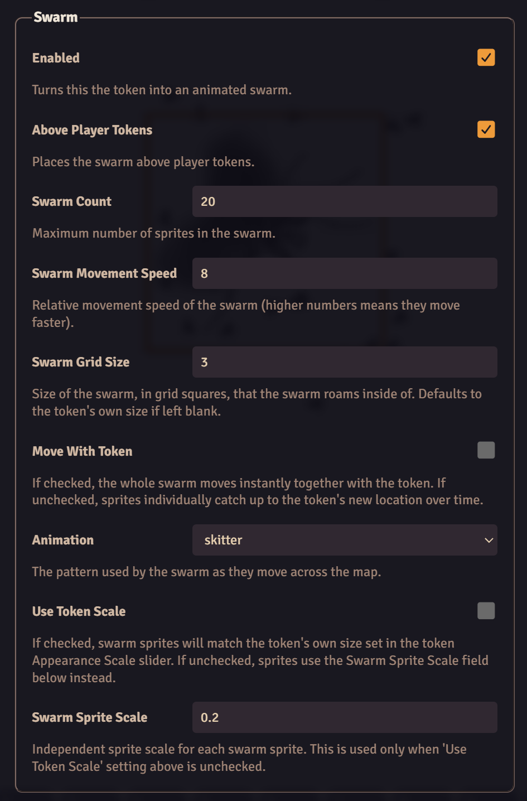

# Swarm
Create swarms of monsters and critters that move as one. Rats, bats, ravens, bugs, pretty butterflies or even trolls (who wouldn't want to fight a swarm of trolls?) every token can be made into a swarm.

## Installation
Install by searching for *swarm* in the module browsing tool or manually using this url: https://github.com/averagejoe77/swarm-reanimated/releases/latest/download/module.json

## Useage

Right click any token (or an actors prototype token) and bring up the token config. Click the **Appearance** Tab, and scroll down to the Swarm section. 

- **Enabled** Enable your swarm by checking the box
- **Above Player Tokens** check this box to have your swarm fly over other tokens/players or leave it unchecked for under. Bats and crows fly over, whereas spiders crawl under.
- **Swarm Count** is the number of critters in your swarm
- **Swarm Movement Speed** lets you configure the critters individual speeds. Are they moving too fast, reduce this number.
- **Swarm Grid Size** allows you to set a bounding box in which the swarm moves around. It will default to the token's grid size bounding box if left blank.
- **Move with Token** allows the individual swarm sprites to move together with the token.
- **Animation** Choose the animation path that the swarm will move in, see below.
- **Use Token Scale** if you want your swarm sprites to match the size of the token scale setting at the top of the Appearance Tab
- **Swarm Sprite Scale** sets the scale of the sprites independently of the token, but only when the **Use Token Scale** setting is unchecked. Setting this to a value and checking the **Use Token Scale** setting will have no effect on the scale of the sprites.

The module works in combination with the token's grid scale settings (at the top of the Appearance Tab) and the token's Scale slider (also at the top of the Appearance tab). 

## Example
Large fly boss token with a small swarm of minion flies around it


# Token Settings
Set the token's grid size to 2x2 and the scale slider to 1


# Swarm Settings
- Enable the swarm in the **Swarm** settings
- Set it to be above players (as flies can be above players)
- Define a count to display around the giant fly boss
- Set the speed
- Choose the Animation (skitter works best for flies)
- **Uncheck** the **Use Token Scale** setting if it is checked; leave it unchecked otherwise
- Set the scale of the sprites to be smaller than the scale of the token (0.2 works good for flies)



## Localization
Current support for:
 * English

If you want to translate this module, download [this file](lang/en.json) and translate it. After that open an issue sharing your translation. Also share the default name convention for your language. You can find that by either, finding a system or module that is already translated to your language and open its module.json. It should look something like this: ``` "languages": [ { "lang": "en", "name": "English", "path": "lang/en.json" } ``` or fork the repo, clone it, edit the lang folder to add your file, update the module.json file to add your language, then make a pull request and I will merge it in.

## Compatibility
Tested on [Foundry VTT](https://foundryvtt.com/  "Foundry VTT") version 14.

## Issues
Any issues, bugs, or feature requests are always welcome to be reported directly to the [Issue Tracker](https://github.com/averagejoe77/swarm-reanimated/issues  "Issue Tracker")

## Licensing

**Swarms Reanimated** is a module for [Foundry VTT](https://foundryvtt.com/ "Foundry VTT") by [Dr.O](https://github.com/oOve/swarm) after original idea by Brunhine and is licensed under a [Creative Commons Attribution 4.0 International License](http://creativecommons.org/licenses/by/4.0/).
